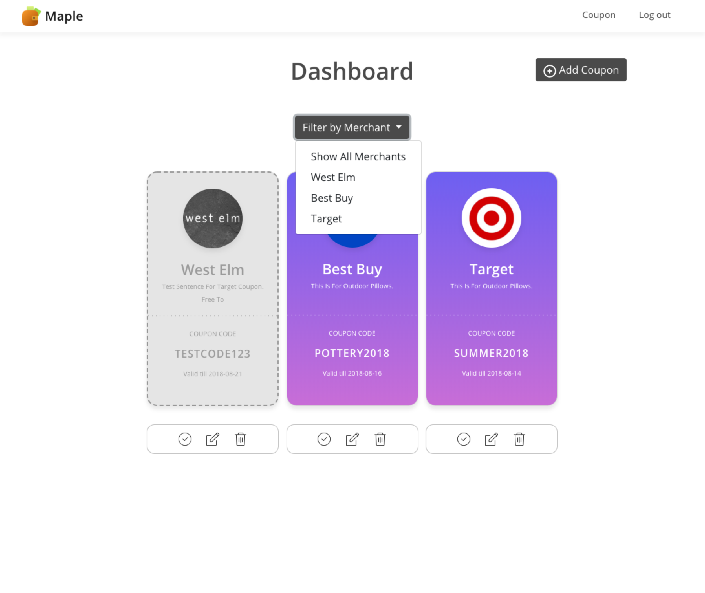

# Maple
  Never lose your coupon savings. Sign up and upload your coupon to be notified before they expire.

  [Demo Maple Here](https://maple-coupons.herokuapp.com/)

# Summary
  Maple is a responsive full stack application that allows users to manage their online coupon codes. Users are able to enter the specific details of the coupon manually and upload an image associated with the coupon. The intent of application is to make management of online savings readily available everywhere without having to remember to bring the stack of paper associated with paper coupons.

# ScreenShots

LandingPage:

Login Up Page:

Coupon Page:

Add Coupon Page:

Delete Coupon Page:

Filter Coupons Page:

# Technologies

## Frontend
  * HTML
  * CSS3
  * Javascript
  * jquery

## Backend
  * Node.js
  * Express.js
  * Passport
  * Mongoose
  * bcryptjs

## Testing
  * Mocha
  * Chai
  * Travis CI

# Hosted on
  Heroku

# Design/Wireframes
  Sketch

# Coming Soon
  - [ ] Notifications before coupons expire.
  - [ ] Extracting of information from uploaded coupon image(OCR).
